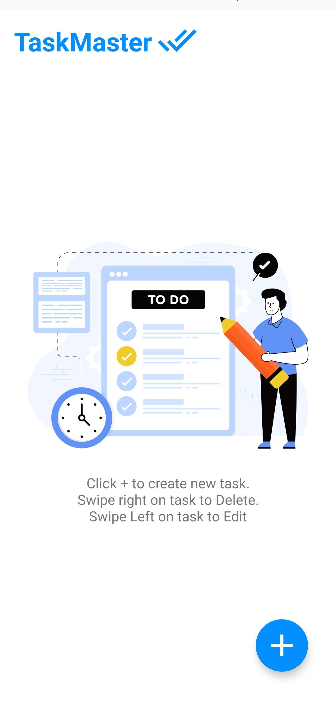
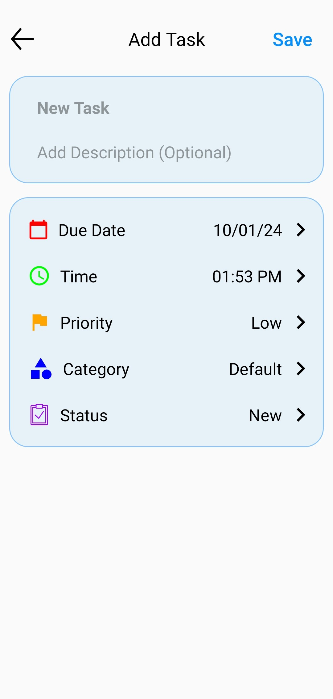

# TaskMaster - To-Do List App

TaskMaster is a feature-rich to-do list app designed to help you manage your tasks effectively. It is built using Java, XML, and SQLite, offering a colorful and intuitive design that enhances the user experience.

## Key Features

### Due Date
Each task comes with a due date, allowing you to set deadlines and stay organized.

### Priority Levels
Assign priority levels (Low, Medium, High) to tasks to prioritize your workflow.

### Category
Categorize tasks and create new categories for better organization.

### Task Status
Mark tasks as New, In Progress, or Completed to track their progress.

### Title and Description
Every task includes a title and a detailed description for better clarity.

### Local Storage
The app utilizes local storage to save tasks, ensuring data persistence.

## Technologies Used

- Java
- XML
- SQLite (for local storage)

## How to Use

1. **Adding Tasks**: Create new tasks by specifying due dates, priority levels, titles, and descriptions.
2. **Categorizing Tasks**: Organize tasks into categories for better management.
3. **Updating Task Status**: Mark tasks as New, In Progress, or Completed as their status changes.
4. **Editing and Deleting**: Modify task details or remove tasks as needed.

## Screenshots

|      Home Screen      |    Add Task Screen    | Home Screen with Tasks |    Edit Task Screen   |
|-----------------------|-----------------------|-----------------------|-----------------------|
|  |  |  |  |

## Installation

1. Clone the repository.
2. Open the project in Android Studio.
3. Build and run the app on an Android emulator or a physical device.

## Download

[Download TaskMaster from here](https://github.com/nagavikram-joga/TaskMaster/releases/download/TaskMasterV1.0/app-debug.apk)

